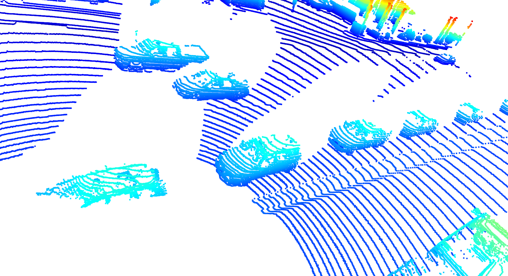
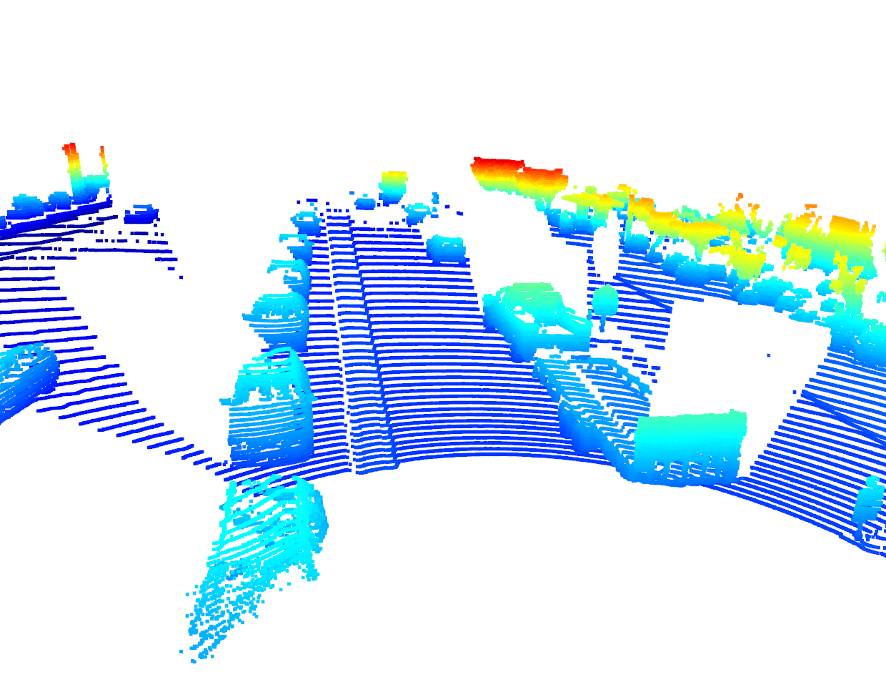
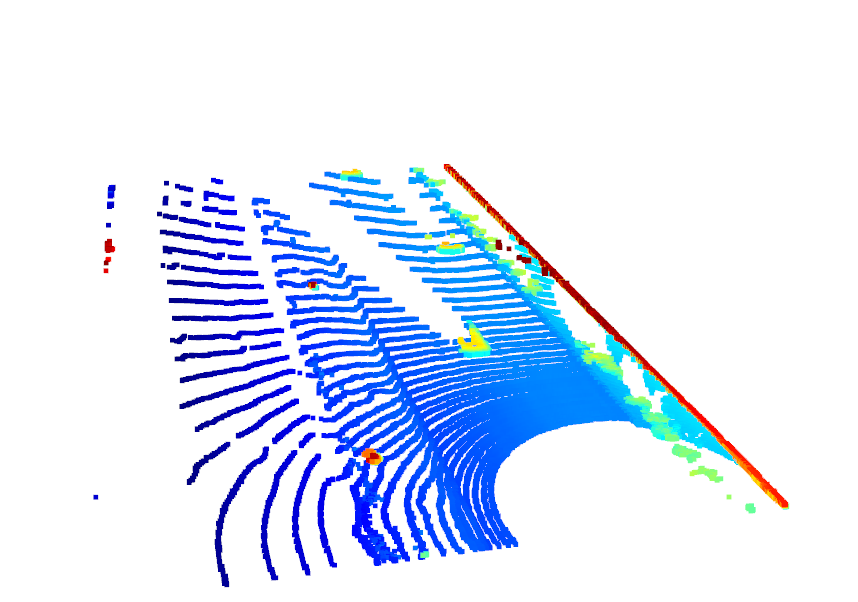
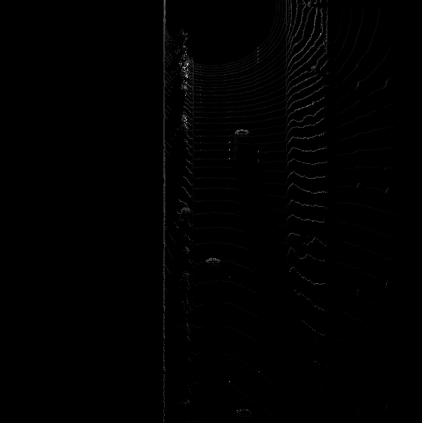
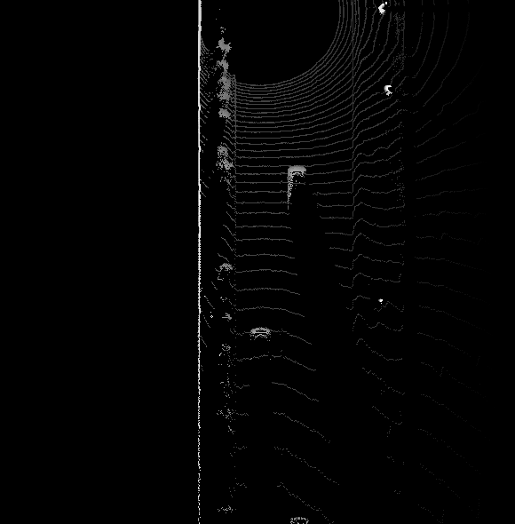

# Writeup: Track 3D-Objects Over Time

Please use this starter template to answer the following questions:

### 1. Write a short recap of the four tracking steps and what you implemented there (filter, track management, association, camera fusion). Which results did you achieve? Which part of the project was most difficult for you to complete, and why?

### Lidar 3D Object Detection

#### Section 1 : Compute Lidar Point-Cloud from Range Image

This task is about extracting and visualizing the range images from the Waymo Open dataset. The intensity and range channels are extracted and converted to 8-bit integer value range. Then OpenCV library is used to stack the range and intensity images vertically and visualize it.

##### S1_Ex.1 : Visualize range image channels (ID_S1_EX1)

###### Overview
1. Extract LiDAR data and range image for the roof-mounted LiDAR.
2. Extract the range and intensity channels from the range image.
3. Convert both channels from real float values to 8-bit range values.
4. Stack the range and intensity channels vertically and visualize it with OpenCV library.

###### Task Preparations:

```` python
data_filename = 'training_segment-1005081002024129653_5313_150_5333_150_with_camera_labels.tfrecord' # Sequence 1
show_only_frames = [0, 1]
exec_data = []
exec_detection = []
exec_visualization = ['show_range_image']
````

###### Code Implementation:

```` python
# visualize range image
def show_range_image(frame, lidar_name):

    ####### ID_S1_EX1 START #######     
    #######
    print("student task ID_S1_EX1")

    # step 1 : extract lidar data and range image for the roof-mounted lidar
    lidar = [obj for obj in frame.lasers if obj.name == lidar_name][0] # get laser data structure from frame
    ri = []
    if len(lidar.ri_return1.range_image_compressed) > 0: # use first sequence
        ri = dataset_pb2.MatrixFloat()
        ri.ParseFromString(zlib.decompress(lidar.ri_return1.range_image_compressed))
        ri = np.array(ri.data).reshape(ri.shape.dims)
    
    # step 2 : extract the range and the intensity channel from the range image
    ri_range_ch = ri[:, :, 0]
    ri_inten_ch = ri[:, :, 1]
    
    # step 3 : set values <0 to zero
    ri_range_ch[ri_range_ch < 0.0] = 0.0
    ri_inten_ch[ri_inten_ch < 0.0] = 0.0
    
    # step 4 : map the range channel onto an 8-bit scale and make sure that the full range of values is appropriately considered
    ri_range_ch = ri_range_ch * 255 / (np.amax(ri_range_ch) - np.amin(ri_range_ch))
    
    # step 5 : map the intensity channel onto an 8-bit scale and normalize with the difference between the 1- and 99-percentile to mitigate the influence of outliers
    ri_inten_ch = np.amax(ri_inten_ch)/2 * ri_inten_ch * 255 / (np.amax(ri_inten_ch) - np.amin(ri_inten_ch))
    
    # step 6 : stack the range and intensity image vertically using np.vstack and convert the result to an unsigned 8-bit integer
    #img_range_intensity = [] # remove after implementing all steps
    ri_range_ch = ri_range_ch.astype(np.uint8)
    ri_inten_ch = ri_inten_ch.astype(np.uint8)

    deg45 = int(ri_range_ch.shape[1] / 8)
    center = int(ri_range_ch.shape[1] / 2)

    ri_range_ch = ri_range_ch[:, center-deg45 : center+deg45]
    ri_inten_ch = ri_inten_ch[:, center-deg45 : center+deg45]

    img_range_intensity = np.vstack((ri_range_ch, ri_inten_ch))
    #######
    ####### ID_S1_EX1 END #######     
    
    return img_range_intensity
````

###### Output Sample


##### S1_Ex.2 : Visualize lidar point-cloud (ID_S1_EX2)

###### Overview

The point cloud is visualized using the Open3D library.

###### Task Preparations

```` python
data_filename = 'training_segment-10963653239323173269_1924_000_1944_000_with_camera_labels.tfrecord' # Sequence 1
show_only_frames = [0, 200]
exec_data = []
exec_detection = []
exec_visualization = ['show_pcl']
exec_list = make_exec_list(exec_data, exec_detection, exec_visualization)
display_pcl = True
````

###### Code Implementation
``` python
# visualize lidar point-cloud
def show_pcl(pcl, enable_vis=False):
    ####### ID_S1_EX2 START #######     
    #######
    print("student task ID_S1_EX2")

    # step 2 : create instance of open3d point-cloud class
    pcd = o3d.geometry.PointCloud()

    # step 3 : set points in pcd instance by converting the point-cloud into 3d vectors (using open3d function Vector3dVector)
    pcd.points = o3d.utility.Vector3dVector(pcl[:,:3]) # take first three elements (x, y, z) describing location and ignore fourth element for intensity

    if (enable_vis):
        # step 1 : initialize open3d with key callback and create window
        vis = o3d.visualization.VisualizerWithKeyCallback()
        vis.create_window(window_name='Lidar Point Cloud')
        
        # step 4 : for the first frame, add the pcd instance to visualization using add_geometry; for all other frames, use update_geometry instead
        vis.add_geometry(pcd)

        # step 5 : visualize point cloud and keep window open until right-arrow is pressed (key-code 262)
        def next_frame_callback(vis_pcl):
            vis_pcl.update_geometry(pcd)
            vis_pcl.poll_events()
            vis_pcl.update_renderer() 
            vis_pcl.close()

        def close_window_callback(vis_pcl):
            vis_pcl.destroy_window()

        vis.register_key_callback(262, next_frame_callback)
        vis.register_key_callback(32, close_window_callback)
        # vis.poll_events()
        # vis.update_renderer()
        vis.run()

    #######
    ####### ID_S1_EX2 END ####### 
```
###### Output Sample




#### Section 2 : Create Birds-Eye View from Lidar PCL
##### S2_Ex.1 : Convert sensor coordinates to BEV-map coordinates (ID_S2_EX1)

###### Overview

1. Convert coordinates in x,y [m] into x,y [pixel] based on width and height of the bev map

###### Task Preparation

````python
data_filename = 'training_segment-1005081002024129653_5313_150_5333_150_with_camera_labels.tfrecord' # Sequence 1
show_only_frames = [0, 1]
exec_data = ['pcl_from_rangeimage']
exec_detection = ['bev_from_pcl']
exec_visualization = []
exec_list = make_exec_list(exec_data, exec_detection, exec_visualization)
````

###### Code Implementation

````python
# create birds-eye view of lidar data
def bev_from_pcl(lidar_pcl, configs):

    # remove lidar points outside detection area and with too low reflectivity
    mask = np.where((lidar_pcl[:, 0] >= configs.lim_x[0]) & (lidar_pcl[:, 0] <= configs.lim_x[1]) &
                    (lidar_pcl[:, 1] >= configs.lim_y[0]) & (lidar_pcl[:, 1] <= configs.lim_y[1]) &
                    (lidar_pcl[:, 2] >= configs.lim_z[0]) & (lidar_pcl[:, 2] <= configs.lim_z[1]))
    lidar_pcl = lidar_pcl[mask]
    
    # shift level of ground plane to avoid flipping from 0 to 255 for neighboring pixels
    lidar_pcl[:, 2] = lidar_pcl[:, 2] - configs.lim_z[0]  

    # convert sensor coordinates to bev-map coordinates (center is bottom-middle)
    ####### ID_S2_EX1 START #######     
    #######
    print("student task ID_S2_EX1")

    ## step 1 :  compute bev-map discretization by dividing x-range by the bev-image height (see configs)
    bev_discret = (configs.lim_x[1] - configs.lim_x[0]) / configs.bev_height

    ## step 2 : create a copy of the lidar pcl and transform all metrix x-coordinates into bev-image coordinates    
    lidar_pcl_cpy = np.copy(lidar_pcl)
    lidar_pcl_cpy[:, 0] = np.int_(np.floor(lidar_pcl_cpy[:, 0] / bev_discret))

    # step 3 : perform the same operation as in step 2 for the y-coordinates but make sure that no negative bev-coordinates occur
    lidar_pcl_cpy[:, 1] = np.int_(np.floor(lidar_pcl_cpy[:, 1] / bev_discret) + ((configs.bev_width + 1) / 2))

    # step 4 : visualize point-cloud using the function show_pcl from a previous task
    show_pcl(lidar_pcl_cpy)
    
    #######
    ####### ID_S2_EX1 END #######

    ...
````

###### Output Sample



##### S2_Ex.2 : Compute intensity layer of the BEV map (ID_S2_EX2)

###### Overview
1. Assign lidar intensity values to the cells of the bird-eye view map.
2. Adjust the intensity in such a way that objects of interest (e.g. vehicles) are clearly visible.

###### Task Preparation

````python
data_filename = 'training_segment-1005081002024129653_5313_150_5333_150_with_camera_labels.tfrecord' # Sequence 1
show_only_frames = [0, 1]
exec_data = ['pcl_from_rangeimage']
exec_detection = ['bev_from_pcl']
exec_visualization = []
exec_list = make_exec_list(exec_data, exec_detection, exec_visualization)
````

###### Code Implementation

````python
# create birds-eye view of lidar data
def bev_from_pcl(lidar_pcl, configs):

    # remove lidar points outside detection area and with too low reflectivity
    mask = np.where((lidar_pcl[:, 0] >= configs.lim_x[0]) & (lidar_pcl[:, 0] <= configs.lim_x[1]) &
                    (lidar_pcl[:, 1] >= configs.lim_y[0]) & (lidar_pcl[:, 1] <= configs.lim_y[1]) &
                    (lidar_pcl[:, 2] >= configs.lim_z[0]) & (lidar_pcl[:, 2] <= configs.lim_z[1]))
    lidar_pcl = lidar_pcl[mask]
    
    # shift level of ground plane to avoid flipping from 0 to 255 for neighboring pixels
    lidar_pcl[:, 2] = lidar_pcl[:, 2] - configs.lim_z[0]  

    # convert sensor coordinates to bev-map coordinates (center is bottom-middle)
    ####### ID_S2_EX1 START #######     
    #######
    
    ...
    
    #######
    ####### ID_S2_EX1 END #######

    # Compute intensity layer of the BEV map
    ####### ID_S2_EX2 START #######     
    #######
    print("student task ID_S2_EX2")

    ## step 1 : create a numpy array filled with zeros which has the same dimensions as the BEV map
    bev_map_i = np.zeros((configs.bev_height + 1, configs.bev_width + 1))

    # step 2 : re-arrange elements in lidar_pcl_cpy by sorting first by x, then y, then -z (use numpy.lexsort)
    lidar_pcl_cpy[lidar_pcl_cpy[:,3] > 1.0, 3] = 1.0 # limit intensity to 1
    mask_sort_idx = np.lexsort((-lidar_pcl_cpy[:, 2], lidar_pcl_cpy[:, 1], lidar_pcl_cpy[:, 0]))
    lidar_pcl_top = lidar_pcl_cpy[mask_sort_idx]

    ## step 3 : extract all points with identical x and y such that only the top-most z-coordinate is kept (use numpy.unique)
    ##          also, store the number of points per x,y-cell in a variable named "counts" for use in the next task
    _ , mask_sort_idx = np.unique(lidar_pcl_top[:, 0:2], return_index=True, axis=0)
    lidar_pcl_top = lidar_pcl_top[mask_sort_idx]

    ## step 4 : assign the intensity value of each unique entry in lidar_top_pcl to the intensity map 
    ##          make sure that the intensity is scaled in such a way that objects of interest (e.g. vehicles) are clearly visible    
    ##          also, make sure that the influence of outliers is mitigated by normalizing intensity on the difference between the max. and min. value within the point cloud
    x_idx = np.int_(lidar_pcl_top[:, 0])
    y_idx = np.int_(lidar_pcl_top[:, 1])
    normalize_flt = (np.amax(lidar_pcl_top[:, 3]) - np.amin(lidar_pcl_top[:, 3]))
    bev_map_i[x_idx, y_idx] = lidar_pcl_top[:, 3] / normalize_flt

    ## step 5 : temporarily visualize the intensity map using OpenCV to make sure that vehicles separate well from the background
    img_intensity = bev_map_i * 256
    img_intensity = img_intensity.astype(np.uint8)
    while (1):
        cv2.imshow('img_intensity', img_intensity)
        if cv2.waitKey(10) & 0xFF == 27:
            break
    cv2.destroyAllWindows()

    #######
    ####### ID_S2_EX2 END ####### 
````

###### Output Sample


##### S2_Ex.3 : Compute height layer of the BEV map (ID_S2_EX3)
###### Overview
1. Make use of the sorted and pruned point-cloud lidar_pcl_top from the previous task
2. Normalize the height in each BEV map pixel by the difference between max. and min. height
3. Fill the "height" channel of the BEV map with data from the point-cloud

###### Task Preparations
````python
data_filename = 'training_segment-1005081002024129653_5313_150_5333_150_with_camera_labels.tfrecord' # Sequence 1
show_only_frames = [0, 1]
exec_data = ['pcl_from_rangeimage']
exec_detection = ['bev_from_pcl']
exec_visualization = []
exec_list = make_exec_list(exec_data, exec_detection, exec_visualization)
````

###### Code Implementation
```` python
# create birds-eye view of lidar data
def bev_from_pcl(lidar_pcl, configs):

    # remove lidar points outside detection area and with too low reflectivity
    mask = np.where((lidar_pcl[:, 0] >= configs.lim_x[0]) & (lidar_pcl[:, 0] <= configs.lim_x[1]) &
                    (lidar_pcl[:, 1] >= configs.lim_y[0]) & (lidar_pcl[:, 1] <= configs.lim_y[1]) &
                    (lidar_pcl[:, 2] >= configs.lim_z[0]) & (lidar_pcl[:, 2] <= configs.lim_z[1]))
    lidar_pcl = lidar_pcl[mask]
    
    # shift level of ground plane to avoid flipping from 0 to 255 for neighboring pixels
    lidar_pcl[:, 2] = lidar_pcl[:, 2] - configs.lim_z[0]  

    # convert sensor coordinates to bev-map coordinates (center is bottom-middle)
    ####### ID_S2_EX1 START #######     
    #######
    
    ...
    
    #######
    ####### ID_S2_EX1 END #######

    # Compute intensity layer of the BEV map
    ####### ID_S2_EX2 START #######     
    #######
    
    ...

    #######
    ####### ID_S2_EX2 END ####### 

    # Compute height layer of the BEV map
    ####### ID_S2_EX3 START #######     
    #######
    print("student task ID_S2_EX3")

    ## step 1 : create a numpy array filled with zeros which has the same dimensions as the BEV map
    bev_map_h = np.zeros((configs.bev_height + 1, configs.bev_width + 1))

    ## step 2 : assign the height value of each unique entry in lidar_top_pcl to the height map 
    ##          make sure that each entry is normalized on the difference between the upper and lower height defined in the config file
    ##          use the lidar_pcl_top data structure from the previous task to access the pixels of the height_map
    x_idx = np.int_(lidar_pcl_top[:, 0])
    y_idx = np.int_(lidar_pcl_top[:, 1])
    normalize_flt = float(np.abs(configs.lim_z[1] - configs.lim_z[0]))
    bev_map_h[x_idx, y_idx] = lidar_pcl_top[:, 2] / normalize_flt

    ## step 3 : temporarily visualize the intensity map using OpenCV to make sure that vehicles separate well from the background
    # visualize height map
    img_height = bev_map_h * 256
    img_height = img_height.astype(np.uint8)
    while (1):
        cv2.imshow('img_height', img_height)
        if cv2.waitKey(10) & 0xFF == 27:
            break
    cv2.destroyAllWindows()

    #######
    ####### ID_S2_EX3 END ####### 
````

###### Output Sample



#### Section 3 : Model-based Object Detection in BEV Image
##### S3_Ex.1 : Add a second model from a GitHub repo (ID_S3_EX1)
###### Overview

###### Task Preparations
```` python
````

###### Code Implementation
```` python
````

###### Output Sample


##### S3_Ex.2 : Extract 3D bounding boxes from model response (ID_S3_EX2)
###### Overview

###### Task Preparations
```` python
````

###### Code Implementation
```` python
````

###### Output Sample


#### Section 4 : Performance Evaluation for Object Detection
##### S4_Ex.1 : Compute intersection-over-union between labels and detections (ID_S4_EX1)
###### Overview

###### Task Preparations
```` python
````

###### Code Implementation
```` python
````

###### Output Sample


##### S4_Ex.2 : Compute false-negatives and false-positives (ID_S4_EX2)
###### Overview

###### Task Preparations
```` python
````

###### Code Implementation
```` python
````

###### Output Sample


##### S4_Ex.3 : Compute precision and recall (ID_S4_EX3)
###### Overview

###### Task Preparations
```` python
````

###### Code Implementation
```` python
````

###### Output Sample


### 2. Do you see any benefits in camera-lidar fusion compared to lidar-only tracking (in theory and in your concrete results)? 


### 3. Which challenges will a sensor fusion system face in real-life scenarios? Did you see any of these challenges in the project?


### 4. Can you think of ways to improve your tracking results in the future?

