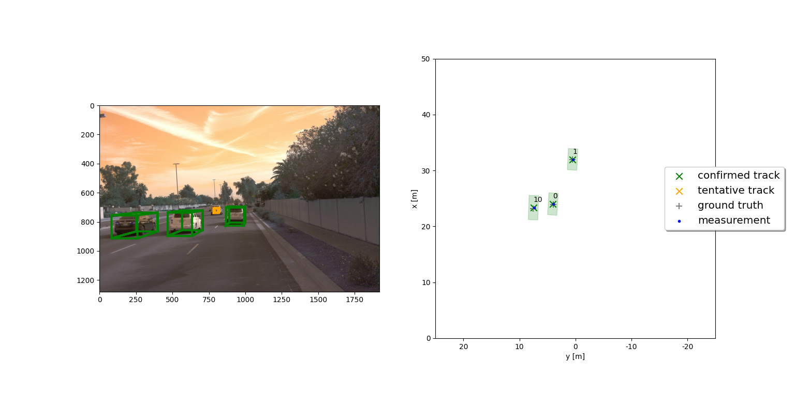

# Writeup: Track 3D-Objects Over Time

Please use this starter template to answer the following questions:

### 1. Write a short recap of the four tracking steps and what you implemented there (filter, track management, association, camera fusion). Which results did you achieve? Which part of the project was most difficult for you to complete, and why?

### Lidar 3D Object Detection

#### Section 1 : Compute Lidar Point-Cloud from Range Image

This task is about extracting and visualizing the range images from the Waymo Open dataset. The intensity and range channels are extracted and converted to 8-bit integer value range. Then OpenCV library is used to stack the range and intensity images vertically and visualize it.

##### S1_Ex.1 : Visualize range image channels (ID_S1_EX1)

###### Overview
1. Extract LiDAR data and range image for the roof-mounted LiDAR.
2. Extract the range and intensity channels from the range image.
3. Convert both channels from real float values to 8-bit range values.
4. Stack the range and intensity channels vertically and visualize it with OpenCV library.

###### Task Preparations:

```` python
data_filename = 'training_segment-1005081002024129653_5313_150_5333_150_with_camera_labels.tfrecord' # Sequence 1
show_only_frames = [0, 1]
exec_data = []
exec_detection = []
exec_visualization = ['show_range_image']
````

###### Code Implementation:

```` python
# visualize range image
def show_range_image(frame, lidar_name):

    ####### ID_S1_EX1 START #######     
    #######
    print("student task ID_S1_EX1")

    # step 1 : extract lidar data and range image for the roof-mounted lidar
    lidar = [obj for obj in frame.lasers if obj.name == lidar_name][0] # get laser data structure from frame
    ri = []
    if len(lidar.ri_return1.range_image_compressed) > 0: # use first sequence
        ri = dataset_pb2.MatrixFloat()
        ri.ParseFromString(zlib.decompress(lidar.ri_return1.range_image_compressed))
        ri = np.array(ri.data).reshape(ri.shape.dims)
    
    # step 2 : extract the range and the intensity channel from the range image
    ri_range_ch = ri[:, :, 0]
    ri_inten_ch = ri[:, :, 1]
    
    # step 3 : set values <0 to zero
    ri_range_ch[ri_range_ch < 0.0] = 0.0
    ri_inten_ch[ri_inten_ch < 0.0] = 0.0
    
    # step 4 : map the range channel onto an 8-bit scale and make sure that the full range of values is appropriately considered
    ri_range_ch = ri_range_ch * 255 / (np.amax(ri_range_ch) - np.amin(ri_range_ch))
    
    # step 5 : map the intensity channel onto an 8-bit scale and normalize with the difference between the 1- and 99-percentile to mitigate the influence of outliers
    ri_inten_ch = np.amax(ri_inten_ch)/2 * ri_inten_ch * 255 / (np.amax(ri_inten_ch) - np.amin(ri_inten_ch))
    
    # step 6 : stack the range and intensity image vertically using np.vstack and convert the result to an unsigned 8-bit integer
    #img_range_intensity = [] # remove after implementing all steps
    ri_range_ch = ri_range_ch.astype(np.uint8)
    ri_inten_ch = ri_inten_ch.astype(np.uint8)

    deg45 = int(ri_range_ch.shape[1] / 8)
    center = int(ri_range_ch.shape[1] / 2)

    ri_range_ch = ri_range_ch[:, center-deg45 : center+deg45]
    ri_inten_ch = ri_inten_ch[:, center-deg45 : center+deg45]

    img_range_intensity = np.vstack((ri_range_ch, ri_inten_ch))
    #######
    ####### ID_S1_EX1 END #######     
    
    return img_range_intensity
````

###### Output Sample


##### S1_Ex.2 : Visualize lidar point-cloud (ID_S1_EX2)

###### Overview

The point cloud is visualized using the Open3D library.

###### Task Preparations

```` python
data_filename = 'training_segment-10963653239323173269_1924_000_1944_000_with_camera_labels.tfrecord' # Sequence 1
show_only_frames = [0, 200]
exec_data = []
exec_detection = []
exec_visualization = ['show_pcl']
exec_list = make_exec_list(exec_data, exec_detection, exec_visualization)
display_pcl = True
````

###### Code Implementation
``` python
# visualize lidar point-cloud
def show_pcl(pcl, enable_vis=False):
    ####### ID_S1_EX2 START #######     
    #######
    print("student task ID_S1_EX2")

    # step 2 : create instance of open3d point-cloud class
    pcd = o3d.geometry.PointCloud()

    # step 3 : set points in pcd instance by converting the point-cloud into 3d vectors (using open3d function Vector3dVector)
    pcd.points = o3d.utility.Vector3dVector(pcl[:,:3]) # take first three elements (x, y, z) describing location and ignore fourth element for intensity

    if (enable_vis):
        # step 1 : initialize open3d with key callback and create window
        vis = o3d.visualization.VisualizerWithKeyCallback()
        vis.create_window(window_name='Lidar Point Cloud')
        
        # step 4 : for the first frame, add the pcd instance to visualization using add_geometry; for all other frames, use update_geometry instead
        vis.add_geometry(pcd)

        # step 5 : visualize point cloud and keep window open until right-arrow is pressed (key-code 262)
        def next_frame_callback(vis_pcl):
            vis_pcl.update_geometry(pcd)
            vis_pcl.poll_events()
            vis_pcl.update_renderer() 
            vis_pcl.close()

        def close_window_callback(vis_pcl):
            vis_pcl.destroy_window()

        vis.register_key_callback(262, next_frame_callback)
        vis.register_key_callback(32, close_window_callback)
        # vis.poll_events()
        # vis.update_renderer()
        vis.run()

    #######
    ####### ID_S1_EX2 END ####### 
```
###### Output Sample


#### Section 2 : Create Birds-Eye View from Lidar PCL
##### S2_Ex.1 : Convert sensor coordinates to BEV-map coordinates (ID_S2_EX1)

###### Overview

1. Convert coordinates in x,y [m] into x,y [pixel] based on width and height of the bev map

###### Task Preparation

````python
data_filename = 'training_segment-1005081002024129653_5313_150_5333_150_with_camera_labels.tfrecord' # Sequence 1
show_only_frames = [0, 1]
exec_data = ['pcl_from_rangeimage']
exec_detection = ['bev_from_pcl']
exec_visualization = []
exec_list = make_exec_list(exec_data, exec_detection, exec_visualization)
````

###### Code Implementation

````python
# create birds-eye view of lidar data
def bev_from_pcl(lidar_pcl, configs):

    # remove lidar points outside detection area and with too low reflectivity
    mask = np.where((lidar_pcl[:, 0] >= configs.lim_x[0]) & (lidar_pcl[:, 0] <= configs.lim_x[1]) &
                    (lidar_pcl[:, 1] >= configs.lim_y[0]) & (lidar_pcl[:, 1] <= configs.lim_y[1]) &
                    (lidar_pcl[:, 2] >= configs.lim_z[0]) & (lidar_pcl[:, 2] <= configs.lim_z[1]))
    lidar_pcl = lidar_pcl[mask]
    
    # shift level of ground plane to avoid flipping from 0 to 255 for neighboring pixels
    lidar_pcl[:, 2] = lidar_pcl[:, 2] - configs.lim_z[0]  

    # convert sensor coordinates to bev-map coordinates (center is bottom-middle)
    ####### ID_S2_EX1 START #######     
    #######
    print("student task ID_S2_EX1")

    ## step 1 :  compute bev-map discretization by dividing x-range by the bev-image height (see configs)
    bev_discret = (configs.lim_x[1] - configs.lim_x[0]) / configs.bev_height

    ## step 2 : create a copy of the lidar pcl and transform all metrix x-coordinates into bev-image coordinates    
    lidar_pcl_cpy = np.copy(lidar_pcl)
    lidar_pcl_cpy[:, 0] = np.int_(np.floor(lidar_pcl_cpy[:, 0] / bev_discret))

    # step 3 : perform the same operation as in step 2 for the y-coordinates but make sure that no negative bev-coordinates occur
    lidar_pcl_cpy[:, 1] = np.int_(np.floor(lidar_pcl_cpy[:, 1] / bev_discret) + ((configs.bev_width + 1) / 2))

    # step 4 : visualize point-cloud using the function show_pcl from a previous task
    show_pcl(lidar_pcl_cpy)
    
    #######
    ####### ID_S2_EX1 END #######

    ...
````

###### Output Sample


##### S2_Ex.2 : Compute intensity layer of the BEV map (ID_S2_EX2)

###### Overview
1. Assign lidar intensity values to the cells of the bird-eye view map.
2. Adjust the intensity in such a way that objects of interest (e.g. vehicles) are clearly visible.

###### Task Preparation

````python
data_filename = 'training_segment-1005081002024129653_5313_150_5333_150_with_camera_labels.tfrecord' # Sequence 1
show_only_frames = [0, 1]
exec_data = ['pcl_from_rangeimage']
exec_detection = ['bev_from_pcl']
exec_visualization = []
exec_list = make_exec_list(exec_data, exec_detection, exec_visualization)
````

###### Code Implementation

````python
# create birds-eye view of lidar data
def bev_from_pcl(lidar_pcl, configs):

    # remove lidar points outside detection area and with too low reflectivity
    mask = np.where((lidar_pcl[:, 0] >= configs.lim_x[0]) & (lidar_pcl[:, 0] <= configs.lim_x[1]) &
                    (lidar_pcl[:, 1] >= configs.lim_y[0]) & (lidar_pcl[:, 1] <= configs.lim_y[1]) &
                    (lidar_pcl[:, 2] >= configs.lim_z[0]) & (lidar_pcl[:, 2] <= configs.lim_z[1]))
    lidar_pcl = lidar_pcl[mask]
    
    # shift level of ground plane to avoid flipping from 0 to 255 for neighboring pixels
    lidar_pcl[:, 2] = lidar_pcl[:, 2] - configs.lim_z[0]  

    # convert sensor coordinates to bev-map coordinates (center is bottom-middle)
    ####### ID_S2_EX1 START #######     
    #######
    
    ...
    
    #######
    ####### ID_S2_EX1 END #######

    # Compute intensity layer of the BEV map
    ####### ID_S2_EX2 START #######     
    #######
    print("student task ID_S2_EX2")

    ## step 1 : create a numpy array filled with zeros which has the same dimensions as the BEV map
    bev_map_i = np.zeros((configs.bev_height + 1, configs.bev_width + 1))

    # step 2 : re-arrange elements in lidar_pcl_cpy by sorting first by x, then y, then -z (use numpy.lexsort)
    lidar_pcl_cpy[lidar_pcl_cpy[:,3] > 1.0, 3] = 1.0 # limit intensity to 1
    mask_sort_idx = np.lexsort((-lidar_pcl_cpy[:, 2], lidar_pcl_cpy[:, 1], lidar_pcl_cpy[:, 0]))
    lidar_pcl_top = lidar_pcl_cpy[mask_sort_idx]

    ## step 3 : extract all points with identical x and y such that only the top-most z-coordinate is kept (use numpy.unique)
    ##          also, store the number of points per x,y-cell in a variable named "counts" for use in the next task
    _ , mask_sort_idx = np.unique(lidar_pcl_top[:, 0:2], return_index=True, axis=0)
    lidar_pcl_top = lidar_pcl_top[mask_sort_idx]

    ## step 4 : assign the intensity value of each unique entry in lidar_top_pcl to the intensity map 
    ##          make sure that the intensity is scaled in such a way that objects of interest (e.g. vehicles) are clearly visible    
    ##          also, make sure that the influence of outliers is mitigated by normalizing intensity on the difference between the max. and min. value within the point cloud
    x_idx = np.int_(lidar_pcl_top[:, 0])
    y_idx = np.int_(lidar_pcl_top[:, 1])
    normalize_flt = (np.amax(lidar_pcl_top[:, 3]) - np.amin(lidar_pcl_top[:, 3]))
    bev_map_i[x_idx, y_idx] = lidar_pcl_top[:, 3] / normalize_flt

    ## step 5 : temporarily visualize the intensity map using OpenCV to make sure that vehicles separate well from the background
    img_intensity = bev_map_i * 256
    img_intensity = img_intensity.astype(np.uint8)
    while (1):
        cv2.imshow('img_intensity', img_intensity)
        if cv2.waitKey(10) & 0xFF == 27:
            break
    cv2.destroyAllWindows()

    #######
    ####### ID_S2_EX2 END ####### 
````

###### Output Sample


##### S2_Ex.3 : Compute height layer of the BEV map (ID_S2_EX3)
###### Overview
1. Make use of the sorted and pruned point-cloud lidar_pcl_top from the previous task
2. Normalize the height in each BEV map pixel by the difference between max. and min. height
3. Fill the "height" channel of the BEV map with data from the point-cloud

###### Task Preparations
````python
data_filename = 'training_segment-1005081002024129653_5313_150_5333_150_with_camera_labels.tfrecord' # Sequence 1
show_only_frames = [0, 1]
exec_data = ['pcl_from_rangeimage']
exec_detection = ['bev_from_pcl']
exec_visualization = []
exec_list = make_exec_list(exec_data, exec_detection, exec_visualization)
````

###### Code Implementation
```` python
# create birds-eye view of lidar data
def bev_from_pcl(lidar_pcl, configs):

    # remove lidar points outside detection area and with too low reflectivity
    mask = np.where((lidar_pcl[:, 0] >= configs.lim_x[0]) & (lidar_pcl[:, 0] <= configs.lim_x[1]) &
                    (lidar_pcl[:, 1] >= configs.lim_y[0]) & (lidar_pcl[:, 1] <= configs.lim_y[1]) &
                    (lidar_pcl[:, 2] >= configs.lim_z[0]) & (lidar_pcl[:, 2] <= configs.lim_z[1]))
    lidar_pcl = lidar_pcl[mask]
    
    # shift level of ground plane to avoid flipping from 0 to 255 for neighboring pixels
    lidar_pcl[:, 2] = lidar_pcl[:, 2] - configs.lim_z[0]  

    # convert sensor coordinates to bev-map coordinates (center is bottom-middle)
    ####### ID_S2_EX1 START #######     
    #######
    
    ...
    
    #######
    ####### ID_S2_EX1 END #######

    # Compute intensity layer of the BEV map
    ####### ID_S2_EX2 START #######     
    #######
    
    ...

    #######
    ####### ID_S2_EX2 END ####### 

    # Compute height layer of the BEV map
    ####### ID_S2_EX3 START #######     
    #######
    print("student task ID_S2_EX3")

    ## step 1 : create a numpy array filled with zeros which has the same dimensions as the BEV map
    bev_map_h = np.zeros((configs.bev_height + 1, configs.bev_width + 1))

    ## step 2 : assign the height value of each unique entry in lidar_top_pcl to the height map 
    ##          make sure that each entry is normalized on the difference between the upper and lower height defined in the config file
    ##          use the lidar_pcl_top data structure from the previous task to access the pixels of the height_map
    x_idx = np.int_(lidar_pcl_top[:, 0])
    y_idx = np.int_(lidar_pcl_top[:, 1])
    normalize_flt = float(np.abs(configs.lim_z[1] - configs.lim_z[0]))
    bev_map_h[x_idx, y_idx] = lidar_pcl_top[:, 2] / normalize_flt

    ## step 3 : temporarily visualize the intensity map using OpenCV to make sure that vehicles separate well from the background
    # visualize height map
    img_height = bev_map_h * 256
    img_height = img_height.astype(np.uint8)
    while (1):
        cv2.imshow('img_height', img_height)
        if cv2.waitKey(10) & 0xFF == 27:
            break
    cv2.destroyAllWindows()

    #######
    ####### ID_S2_EX3 END ####### 
````

###### Output Sample


#### Section 3 : Model-based Object Detection in BEV Image
##### S3_Ex.1 : Add a second model from a GitHub repo (ID_S3_EX1)
###### Overview

1. In addition to Complex YOLO, extract the code for output decoding and post-processing from the GitHub repo.

###### Task Preparations
```` python
data_filename = 'training_segment-1005081002024129653_5313_150_5333_150_with_camera_labels.tfrecord' # Sequence 1
show_only_frames = [50, 51]
exec_data = ['pcl_from_rangeimage', 'load_image']
exec_detection = ['bev_from_pcl', 'detect_objects']
exec_visualization = ['show_objects_in_bev_labels_in_camera']
configs_det = det.load_configs(model_name='fpn_resnet')
````

###### Code Implementation
```` python
# create model according to selected model type
def create_model(configs):

    # check for availability of model file
    assert os.path.isfile(configs.pretrained_filename), "No file at {}".format(configs.pretrained_filename)

    # create model depending on architecture name
    if (configs.arch == 'darknet') and (configs.cfgfile is not None):
        print('using darknet')
        model = darknet(cfgfile=configs.cfgfile, use_giou_loss=configs.use_giou_loss)    
    
    elif 'fpn_resnet' in configs.arch:
        print('using ResNet architecture with feature pyramid')
        
        ####### ID_S3_EX1-4 START #######     
        #######
        print("student task ID_S3_EX1-4")
        model = fpn_resnet.get_pose_net(
                num_layers = configs.num_layers,
                heads = configs.heads, 
                head_conv = configs.head_conv, 
                imagenet_pretrained = configs.imagenet_pretrained
            )

        #######
        ####### ID_S3_EX1-4 END #######     
    
    else:
        assert False, 'Undefined model backbone'

    # load model weights
    model.load_state_dict(torch.load(configs.pretrained_filename, map_location='cpu'))
    print('Loaded weights from {}\n'.format(configs.pretrained_filename))

    # set model to evaluation state
    configs.device = torch.device('cpu' if configs.no_cuda else 'cuda:{}'.format(configs.gpu_idx))
    model = model.to(device=configs.device)  # load model to either cpu or gpu
    model.eval()          

    return model
````

##### S3_Ex.2 : Extract 3D bounding boxes from model response (ID_S3_EX2)
###### Overview

1. Transform BEV coordinates in [pixels] into vehicle coordinates in [m]
2. Convert model output to expected bounding box format `[class-id, x, y, z, h, w, l, yaw]`

###### Task Preparations
```` python
data_filename = 'training_segment-1005081002024129653_5313_150_5333_150_with_camera_labels.tfrecord' # Sequence 1
show_only_frames = [50, 51]
exec_data = ['pcl_from_rangeimage', 'load_image']
exec_detection = ['bev_from_pcl', 'detect_objects']
exec_visualization = ['show_objects_in_bev_labels_in_camera']
configs_det = det.load_configs(model_name='fpn_resnet')
````

###### Code Implementation
```` python
# detect trained objects in birds-eye view
def detect_objects(input_bev_maps, model, configs):

    # deactivate autograd engine during test to reduce memory usage and speed up computations
    with torch.no_grad():  

        # perform inference
        outputs = model(input_bev_maps)

        # decode model output into target object format
        if 'darknet' in configs.arch:

            # perform post-processing
            output_post = post_processing_v2(outputs, conf_thresh=configs.conf_thresh, nms_thresh=configs.nms_thresh) 
            detections = []
            for sample_i in range(len(output_post)):
                if output_post[sample_i] is None:
                    continue
                detection = output_post[sample_i]
                for obj in detection:
                    x, y, w, l, im, re, _, _, _ = obj
                    yaw = np.arctan2(im, re)
                    detections.append([1, x, y, 0.0, 1.50, w, l, yaw])    

        elif 'fpn_resnet' in configs.arch:
            # decode output and perform post-processing
            
            ####### ID_S3_EX1-5 START #######     
            #######
            print("student task ID_S3_EX1-5")
            outputs['hm_cen'] = _sigmoid(outputs['hm_cen'])
            outputs['cen_offset'] = _sigmoid(outputs['cen_offset'])
            # detections size (batch_size, K, 10)
            detections = decode(outputs['hm_cen'], outputs['cen_offset'], outputs['direction'], outputs['z_coor'],
                                outputs['dim'], K=configs.K)
            detections = detections.cpu().numpy().astype(np.float32)
            detections = post_processing(detections, configs)
            detections = detections[0][1]
            print(detections)

            #######
            ####### ID_S3_EX1-5 END #######     

            

    ####### ID_S3_EX2 START #######     
    #######
    # Extract 3d bounding boxes from model response
    print("student task ID_S3_EX2")
    objects = [] 

    ## step 1 : check whether there are any detections
    ## step 2 : loop over all detections
    for detection in detections:
        obj_id, obj_x, obj_y, obj_z, obj_h, obj_w, obj_l, obj_yaw = detection
    
        ## step 3 : perform the conversion using the limits for x, y and z set in the configs structure
        bev_xdiscret = (configs.lim_x[1] - configs.lim_x[0]) / configs.bev_height
        bev_ydiscret = (configs.lim_y[1] - configs.lim_y[0]) / configs.bev_width

        obj_id = 1 # vehicle id
        yaw = -obj_yaw # Note that the yaw angle returned by the network needs to be inverted in order to account for the directions of the coordinate axes
        x = obj_y * bev_xdiscret # multiply by discrete to convert back to real values
        y = (obj_x * bev_ydiscret) - ((configs.lim_y[1] - configs.lim_y[0]) / 2.0)
        z = obj_z
        w = obj_w * bev_ydiscret 
        l = obj_l * bev_xdiscret
        h = obj_h
        
        if ((x >= configs.lim_x[0]) and (x <= configs.lim_x[1]) and
            (y >= configs.lim_y[0]) and (y <= configs.lim_y[1]) and
            (z >= configs.lim_z[0]) and (z <= configs.lim_z[1])):
            ## step 4 : append the current object to the 'objects' array
            objects.append([obj_id, x, y, z, h, w, l, yaw])
        
    #######
    ####### ID_S3_EX2 START #######   
    
    return objects
````

###### Output Sample


#### Section 4 : Performance Evaluation for Object Detection
##### S4_Ex.1 : Compute intersection-over-union between labels and detections (ID_S4_EX1)
###### Overview

1. For all pairings of ground-truth labels and detected objects, compute the degree of geometrical overlap
2. The function `tools.compute_box_corners` returns the four corners of a bounding box which can be used with the Polygon structure of the Shapely toolbox
3. Assign each detected object to a label only if the IOU exceeds a given threshold
4. In case of multiple matches, keep the object/label pair with max. IOU
5. Count all object/label-pairs and store them as “true positives”

###### Task Preparations
```` python
data_filename = 'training_segment-1005081002024129653_5313_150_5333_150_with_camera_labels.tfrecord' # Sequence 1
show_only_frames = [50, 51]
exec_data = ['pcl_from_rangeimage']
exec_detection = ['bev_from_pcl', 'detect_objects', 'validate_object_labels', 'measure_detection_performance']
exec_visualization = ['show_detection_performance']
configs_det = det.load_configs(model_name='darknet')
````

###### Code Implementation
```` python
# compute various performance measures to assess object detection
def measure_detection_performance(detections, labels, labels_valid, min_iou=0.5):
    
     # find best detection for each valid label 
    true_positives = 0 # no. of correctly detected objects
    center_devs = []
    ious = []
    for label, valid in zip(labels, labels_valid):
        matches_lab_det = []
        if valid: # exclude all labels from statistics which are not considered valid
            
            # compute intersection over union (iou) and distance between centers

            ####### ID_S4_EX1 START #######     
            #######
            print("student task ID_S4_EX1 ")

            ## step 1 : extract the four corners of the current label bounding-box
            label_bbox = tools.compute_box_corners(label.box.center_x, label.box.center_y, label.box.width, label.box.length, label.box.heading)
            
            ## step 2 : loop over all detected objects
            for detection in detections:

                ## step 3 : extract the four corners of the current detection
                # obj = [obj_id, x, y, z, h, w, l, yaw]
                _, det_x, det_y, det_z, _, det_w, det_l, det_yaw = detection
                detct_bbox = tools.compute_box_corners(det_x, det_y, det_w, det_l, det_yaw)
                
                ## step 4 : computer the center distance between label and detection bounding-box in x, y, and z
                distances = np.array([label.box.center_x - det_x, label.box.center_y - det_y, label.box.center_z - det_z])
                distance_x = distances.item(0)
                distance_y = distances.item(1)
                distance_z = distances.item(2)                
                
                ## step 5 : compute the intersection over union (IOU) between label and detection bounding-box
                label_poly = Polygon(label_bbox)
                detct_poly = Polygon(detct_bbox)
                
                intersection_area = label_poly.intersection(detct_poly).area
                union_area = label_poly.union(detct_poly).area
                
                iou = intersection_area / (union_area + np.finfo(float).eps)
                
                ## step 6 : if IOU exceeds min_iou threshold, store [iou,dist_x, dist_y, dist_z] in matches_lab_det and increase the TP count
                if (iou > min_iou):
                    match = [iou, distance_x, distance_y, distance_z]
                    matches_lab_det.append(match)
                    true_positives += 1
                
            #######
            ####### ID_S4_EX1 END #######     
            
        # find best match and compute metrics
        if matches_lab_det:
            best_match = max(matches_lab_det,key=itemgetter(1)) # retrieve entry with max iou in case of multiple candidates   
            ious.append(best_match[0])
            center_devs.append(best_match[1:])


    ####### ID_S4_EX2 START #######     
    #######
    
    ...
    
    #######
    ####### ID_S4_EX2 END #######     
    
    pos_negs = [all_positives, true_positives, false_negatives, false_positives]
    det_performance = [ious, center_devs, pos_negs]
    
    return det_performance
````

###### Output Sample


##### S4_Ex.2 : Compute false-negatives and false-positives (ID_S4_EX2)
###### Overview

1. Compute the number of false-negatives and false-positives based on the results from IOU and the number of ground-truth labels

###### Task Preparations
```` python
data_filename = 'training_segment-1005081002024129653_5313_150_5333_150_with_camera_labels.tfrecord' # Sequence 1
show_only_frames = [50, 51]
exec_data = ['pcl_from_rangeimage']
exec_detection = ['bev_from_pcl', 'detect_objects', 'validate_object_labels', 'measure_detection_performance']
exec_visualization = ['show_detection_performance']
configs_det = det.load_configs(model_name='darknet')
````

###### Code Implementation
````python
# compute various performance measures to assess object detection
def measure_detection_performance(detections, labels, labels_valid, min_iou=0.5):
    
     # find best detection for each valid label 
    true_positives = 0 # no. of correctly detected objects
    center_devs = []
    ious = []
    for label, valid in zip(labels, labels_valid):
        matches_lab_det = []
        if valid: # exclude all labels from statistics which are not considered valid
            
            # compute intersection over union (iou) and distance between centers

            ####### ID_S4_EX1 START #######     
            #######

            ...
                
            #######
            ####### ID_S4_EX1 END #######     
            
        # find best match and compute metrics
        if matches_lab_det:
            best_match = max(matches_lab_det,key=itemgetter(1)) # retrieve entry with max iou in case of multiple candidates   
            ious.append(best_match[0])
            center_devs.append(best_match[1:])


    ####### ID_S4_EX2 START #######     
    #######
    print("student task ID_S4_EX2")
    
    # compute positives and negatives for precision/recall
    
    ## step 1 : compute the total number of positives present in the scene
    all_positives = labels_valid.sum()

    ## step 2 : compute the number of false negatives
    false_negatives = abs(all_positives - true_positives)

    ## step 3 : compute the number of false positives
    false_positives = abs(len(detections) - true_positives)
    
    #######
    ####### ID_S4_EX2 END #######     
    
    pos_negs = [all_positives, true_positives, false_negatives, false_positives]
    det_performance = [ious, center_devs, pos_negs]
    
    return det_performance
````

###### Output Sample


##### S4_Ex.3 : Compute precision and recall (ID_S4_EX3)
###### Overview

1. Compute “precision” over all evaluated frames using true-positives and false-positives
2. Compute “recall” over all evaluated frames using true-positives and false-negatives

###### Task Preparations
```` python
data_filename = 'training_segment-1005081002024129653_5313_150_5333_150_with_camera_labels.tfrecord' # Sequence 1
show_only_frames = [50, 150]
exec_data = ['pcl_from_rangeimage']
exec_detection = ['bev_from_pcl', 'detect_objects', 'validate_object_labels', 'measure_detection_performance']
exec_visualization = ['show_detection_performance']
configs_det = det.load_configs(model_name='darknet')
````

###### Code Implementation
````python
# evaluate object detection performance based on all frames
def compute_performance_stats(det_performance_all):

    # extract elements
    ious = []
    center_devs = []
    pos_negs = []
    for item in det_performance_all:
        ious.append(item[0])
        center_devs.append(item[1])
        pos_negs.append(item[2])
    
    ####### ID_S4_EX3 START #######     
    #######    
    print('student task ID_S4_EX3')

    ## step 1 : extract the total number of positives, true positives, false negatives and false positives
    pos_negs_array = np.asarray(pos_negs)
    true_positives = sum(pos_negs_array[:,1])
    false_negatives = sum(pos_negs_array[:,2])
    false_positives = sum(pos_negs_array[:,3])
    
    ## step 2 : compute precision
    precision = true_positives / float(true_positives + false_positives)

    ## step 3 : compute recall 
    recall = true_positives / float(true_positives + false_negatives)

    #######    
    ####### ID_S4_EX3 END #######     
    print('precision = ' + str(precision) + ", recall = " + str(recall))   

    ...
````

###### Output Sample


To make sure that the code produces plausible results, the flag ``configs_det.use_labels_as_objects`` should be set to True in a second run. The precision and recall when using the labeled objects as the detections the precision and recall should be equal to 1.0 and errors equal to 0.0


### Multi-target Tracking and Sensor Fusion

#### S1: Kalman filter Tracking

##### Overview
1. EKF is implemented including appropriate system matrix F and process noise Q for constant velocity motion model.
2. EKF is applied to a simple single-target scenario with lidar only.
3. The mean RMSE is 0.35 or smaller.

### Results


#### Code Implementation

````python
class Filter:
    '''Kalman filter class'''
    def __init__(self):
        self.dim_state = params.dim_state # process model dimension
        self.dt = params.dt # sample time
        self.q = params.q # process noise value for Q covariance

    def F(self):
        ############
        # Step 1: implement and return system matrix F
        ############
        F = np.eye((self.dim_state))
        F = np.asmatrix(F) # convert from array to matrix instance
        F[0, 3] = self.dt
        F[1, 4] = self.dt
        F[2, 5] = self.dt
        return F

    def Q(self):
        ############
        # Step 1: implement and return process noise covariance Q
        ############

        dt2 = self.dt ** 2
        dt3 = self.dt * dt2
        
        q_11 = dt3 * self.q / 3.0
        q_13 = dt2 * self.q / 2.0
        q_33 = self.dt * self.q

        return np.matrix([[q_11,  0.0,  0.0, q_13,  0.0,  0.0],
                         [ 0.0, q_11,  0.0,  0.0, q_13,  0.0],
                         [ 0.0,  0.0, q_11,  0.0,  0.0, q_13],
                         [q_13,  0.0,  0.0, q_33,  0.0,  0.0],
                         [ 0.0, q_13,  0.0,  0.0, q_33,  0.0],
                         [ 0.0,  0.0, q_13,  0.0,  0.0, q_33]])

    def predict(self, track):
        ############
        # Step 1: predict state x and estimation error covariance P to next timestep, save x and P in track
        ############

        x_ = self.F() * track.x
        P_ = self.F() * track.P * self.F().T + self.Q()
        
        track.set_x(x_)
        track.set_P(P_)

    def update(self, track, meas):
        ############
        # Step 1: update state x and covariance P with associated measurement, save x and P in track
        ############
        
        H = meas.sensor.get_H( track.x )                # measurement jacobina matrix
        
        gamma = self.gamma(track, meas)                 # residual vector
        S = self.S(track, meas, H)                      # residual covariance
        
        I = np.asmatrix(np.eye((self.dim_state)))       # identity matrix
        
        K = track.P * H.T * S.I                         # Kalman gain
        x = track.x + K * gamma                         # state update
        P = (I - K*H) * track.P                         # covariance update
        
        track.set_x(x)                                  # track state assignment
        track.set_P(P)                                  # track covariance assignment
        
        track.update_attributes(meas)
    
    def gamma(self, track, meas):
        ############
        # Step 1: calculate and return residual gamma
        ############
        
        return (meas.z - meas.sensor.get_hx( track.x )) # innovation/residual

    def S(self, track, meas, H):
        ############
        # Step 1: calculate and return covariance of residual S
        ############
        
        return (H * track.P * H.T) + meas.R
````

#### S2: Track Management

##### Overview
1. Track initialization from unassigned measurements is implemented.
2. A track score is defined and implemented.
3. Track states are defined and implemented, e.g. “tentative”, “confirmed”.
4. Old tracks are deleted for not updated tracks.
5. The tracking works properly if after applying the track management to a new sequence (see instructions), the visualization shows that a new track is initialized automatically where unassigned measurements occur, the true track is confirmed quickly, and the track is deleted after it has vanished from the visible range. There is one single track without track losses in between. Please upload the RMSE plot as png or pdf file.

#### Code Implementation

Single Track Class
````python
class Track:
    '''Track class with state, covariance, id, score'''
    def __init__(self, meas, id):
        print('creating track no.', id)
        M_rot = meas.sensor.sens_to_veh[0:3, 0:3] # rotation matrix from sensor to vehicle coordinates
        
        ############
        # Step 2: initialization:
        # - replace fixed track initialization values by initialization of x and P based on 
        # unassigned measurement transformed from sensor to vehicle coordinates
        # - initialize track state and track score with appropriate values
        ############
        
        self.x = np.asmatrix(np.zeros((6,1)))
        self.P = np.asmatrix(np.zeros((6,6)))
        
        # transform 3D measurement vector to homogenous coordinate
        pos_sens = np.asmatrix(np.ones((4, 1)))
        pos_sens[0:3] = meas.z

        # extract homogenous transformation matrix
        pos_veh = meas.sensor.sens_to_veh * pos_sens
        self.x[0:3] = pos_veh[0:3]
        
        P_pos = M_rot * meas.R * M_rot.T    # position state covariance
        
        P_vel = np.asmatrix(np.eye((3)))                 # velocity state covariance
        P_vel[0, 0] = params.sigma_p44**2
        P_vel[1, 1] = params.sigma_p55**2
        P_vel[2, 2] = params.sigma_p66**2
        
        self.P[0:3, 0:3] = P_pos
        self.P[3:6, 3:6] = P_vel
        
        self.state = 'initialized'
        self.score = 1.0 / params.window
                     
        # other track attributes
        self.id = id
        self.width = meas.width
        self.length = meas.length
        self.height = meas.height
        self.yaw =  np.arccos(M_rot[0,0]*np.cos(meas.yaw) + M_rot[0,1]*np.sin(meas.yaw)) # transform rotation from sensor to vehicle coordinates
        self.t = meas.t

    def set_x(self, x):
        self.x = x
        
    def set_P(self, P):
        self.P = P  
        
    def set_t(self, t):
        self.t = t  
        
    def update_attributes(self, meas):
        # use exponential sliding average to estimate dimensions and orientation
        if meas.sensor.name == 'lidar':
            c = params.weight_dim
            self.width = c*meas.width + (1 - c)*self.width
            self.length = c*meas.length + (1 - c)*self.length
            self.height = c*meas.height + (1 - c)*self.height
            M_rot = meas.sensor.sens_to_veh
            self.yaw = np.arccos(M_rot[0,0]*np.cos(meas.yaw) + M_rot[0,1]*np.sin(meas.yaw)) # transform rotation from sensor to vehicle coordinates
  
````

Track Managment Class

````python
class Trackmanagement:
    '''Track manager with logic for initializing and deleting objects'''
    def __init__(self):
        self.N = 0 # current number of tracks
        self.track_list = []
        self.last_id = -1
        self.result_list = []
        
    def manage_tracks(self, unassigned_tracks, unassigned_meas, meas_list):  
        ############
        # Step 2: implement track management:
        # - decrease the track score for unassigned tracks
        # - delete tracks if the score is too low or P is too big (check params.py for parameters that might be helpful, but
        # feel free to define your own parameters)
        ############
        
        # decrease score for unassigned tracks
        for i in unassigned_tracks:
            track = self.track_list[i]
            # check visibility    
            if meas_list: # if not empty
                if meas_list[0].sensor.in_fov(track.x):
                    # your code goes here
                    track.score -= (1.0 / params.window)
                    
                    if track.score < 0:
                        track.score = 0.0

        # delete old tracks
        for track in self.track_list:
           
            # holds only for confirmed tracks
            delete_threshold = -1
            if track.state == 'confirmed':
                delete_threshold = params.delete_threshold_confirmed
            elif track.state == 'tentative' or track.state == 'initialized':
                delete_threshold = params.delete_threshold_tentative

            if track.score <= delete_threshold and (track.P[0,0] >= params.max_P or track.P[1,1] >= params.max_P):
                self.delete_track(track)
                
        # initialize new track with unassigned measurement
        for j in unassigned_meas: 
            if meas_list[j].sensor.name == 'lidar': # only initialize with lidar measurements
                self.init_track(meas_list[j])
            
    def addTrackToList(self, track):
        self.track_list.append(track)
        self.N += 1
        self.last_id = track.id

    def init_track(self, meas):
        track = Track(meas, self.last_id + 1)
        self.addTrackToList(track)

    def delete_track(self, track):
        print('deleting track no.', track.id)
        self.track_list.remove(track)
        
    def handle_updated_track(self, track):      
        ############
        # Step 2: implement track management for updated tracks:
        # - increase track score
        # - set track state to 'tentative' or 'confirmed'
        ############

        track.score += (1.0 / params.window)
        
        if track.score > 1.0:
            track.score = 1.0
        
        if (track.state == 'tentative' and track.score >= params.confirmed_threshold):
            track.state = 'confirmed'
        elif (track.state == 'initialized' and track.score >= params.tentative_threshold):
            track.state = 'tentative'
````

#### S3: Data Association

##### Overview
1. Nearest neighbor data association including association matrix is implemented.
2. A method that returns nearest track and measurement for association is implemented.
3. Gating method with chi-square-distribution is implemented to reduce complexity.
4. The association works properly if you see the following results: After applying the data association to a new sequence with multiple targets, multiple tracks are updated with multiple measurements. The console output shows that each measurement is used at most once and each track is updated at most once.
5. The visualization should show that there are no confirmed “ghost tracks” that do not exist in reality. There may be initialized or tentative “ghost tracks” as long as they are deleted after several frames. Please upload the RMSE plot as png or pdf file.

#### Code Implementation

````python
class Association:
    '''Data association class with single nearest neighbor association and gating based on Mahalanobis distance'''
    def __init__(self):
        self.association_matrix = np.matrix([])
        self.unassigned_tracks = []
        self.unassigned_meas = []
        
    def associate(self, track_list, meas_list, KF):

        ############
        # Step 3: association:
        # - replace association_matrix with the actual association matrix based on Mahalanobis distance (see below) for all tracks and all measurements
        # - update list of unassigned measurements and unassigned tracks
        ############
        
        # the following only works for at most one track and one measurement
        N = len(track_list)
        M = len(meas_list)
        
        self.association_matrix = np.matrix([]) # reset matrix
        self.unassigned_tracks = [] # reset lists
        self.unassigned_meas = []
        
        if len(meas_list) > 0:
            self.unassigned_meas = list(range(M))
        if len(track_list) > 0:
            self.unassigned_tracks = list(range(N))
        if len(meas_list) > 0 and len(track_list) > 0: 
            self.association_matrix = np.asmatrix(np.inf * np.ones((N,M)))
        
        # loop over all tracks and all measurements to set up association matrix                  
        for n, track in enumerate(track_list):
            for m, meas in enumerate(meas_list):
                dist = self.MHD(track, meas, KF)
                if self.gating(dist, meas.sensor):
                    self.association_matrix[n, m] = dist

    def get_closest_track_and_meas(self):

		############
        # Step 3: find closest track and measurement:
        # - find minimum entry in association matrix
        # - delete row and column
        # - remove corresponding track and measurement from unassigned_tracks and unassigned_meas
        # - return this track and measurement
        ############

        # find closest track and measurement for next update
        A = self.association_matrix
        if np.min(A) == np.inf:
            return np.nan, np.nan

        # get indices of minimum entry
        ij_min = np.unravel_index(np.argmin(A, axis=None), A.shape) 
        ind_track = ij_min[0]
        ind_meas = ij_min[1]

        # delete row and column for next update
        A = np.delete(A, ind_track, 0) 
        A = np.delete(A, ind_meas, 1)
        self.association_matrix = A
        
        # update this track with this measurement
        update_track = self.unassigned_tracks[ind_track] 
        update_meas = self.unassigned_meas[ind_meas]
        
        # remove this track and measurement from list
        self.unassigned_tracks.remove(update_track) 
        self.unassigned_meas.remove(update_meas)
        
        return update_track, update_meas

    def gating(self, MHD, sensor): 
        ############
        # Step 3: return True if measurement lies inside gate, otherwise False
        ############
               
        if sensor.name == 'lidar':
            dof = 2 # lidar DOF, features (x, y, z)
        elif sensor.name == 'camera':
            dof = 1 # camera DOF, features (x, y)
               
        limit = chi2.ppf(params.gating_threshold, df=dof)
        
        if MHD < limit:
            return True
        else:
            return False
        
    def MHD(self, track, meas, KF):
        ############
        # Step 3: calculate and return Mahalanobis distance
        ############
               
        H = meas.sensor.get_H( track.x )
        
        g = KF.gamma(track, meas)
        S = KF.S(track, meas, H)
        
        mahalo_dist = np.transpose(g) * np.linalg.inv(S) * g
        
        return mahalo_dist

    def associate_and_update(self, manager, meas_list, KF):
        # associate measurements and tracks
        self.associate(manager.track_list, meas_list, KF)
    
        # update associated tracks with measurements
        while self.association_matrix.shape[0]>0 and self.association_matrix.shape[1]>0:
            
            # search for next association between a track and a measurement
            ind_track, ind_meas = self.get_closest_track_and_meas()
            if np.isnan(ind_track):
                print('---no more associations---')
                break
            track = manager.track_list[ind_track]
            
            # check visibility, only update tracks in fov    
            if not meas_list[0].sensor.in_fov(track.x):
                continue
            
            # Kalman update
            print('update track', track.id, 'with', meas_list[ind_meas].sensor.name, 'measurement', ind_meas)
            KF.update(track, meas_list[ind_meas])
            
            # update score and track state 
            manager.handle_updated_track(track)
            
            # save updated track
            manager.track_list[ind_track] = track
            
        # run track management 
        manager.manage_tracks(self.unassigned_tracks, self.unassigned_meas, meas_list)
        
        for track in manager.track_list:            
            print('track', track.id, 'score =', track.score)
````

#### S4: Sensor Fusion

##### Overview
1. Camera measurements including appropriate covariance matrix R are implemented.
2. Nonlinear camera measurement model h(x) is implemented. The Jacobian H is given.
3. A method that checks whether an object can be seen by the camera or is outside the field of view is implemented.
4. The tracking works properly if you see the following results: The tracking loop now updates all tracks with lidar measurements, then with camera measurements. The console output shows lidar updates followed by camera updates.
5. The visualization shows that the tracking performs well, again no confirmed ghost tracks or track losses should occur.

#### Code Implementation

Sensor Class

````python
class Sensor:
    '''Sensor class including measurement matrix'''
    def __init__(self, name, calib):
        self.name = name
        if name == 'lidar':
            self.dim_meas = 3
            self.sens_to_veh = np.matrix(np.identity((4))) # transformation sensor to vehicle coordinates equals identity matrix because lidar detections are already in vehicle coordinates
            self.fov = [-np.pi/2, np.pi/2] # angle of field of view in radians
        
        elif name == 'camera':
            self.dim_meas = 2
            self.sens_to_veh = np.matrix(calib.extrinsic.transform).reshape(4,4) # transformation sensor to vehicle coordinates
            self.f_i = calib.intrinsic[0] # focal length i-coordinate
            self.f_j = calib.intrinsic[1] # focal length j-coordinate
            self.c_i = calib.intrinsic[2] # principal point i-coordinate
            self.c_j = calib.intrinsic[3] # principal point j-coordinate
            self.fov = [-0.35, 0.35] # angle of field of view in radians, inaccurate boundary region was removed
            
        self.veh_to_sens = np.linalg.inv(self.sens_to_veh) # transformation vehicle to sensor coordinates
    
    def in_fov(self, x):
        # check if an object x can be seen by this sensor
        ############
        # Step 4: implement a function that returns True if x lies in the sensor's field of view, 
        # otherwise False.
        ############
        pos_veh = np.asmatrix(np.ones((4, 1)))
        pos_veh[0:3] = x[0:3]
        
        pos_sens = self.veh_to_sens * pos_veh # convert position from vehicle to sensor coordinates
        px, py, _, _ = pos_sens
        
        alpha = np.arctan2(py, px)
        if alpha > self.fov[0] and alpha < self.fov[1]:
            return True
        
        return False
             
    def get_hx(self, x):    
        # calculate nonlinear measurement expectation value h(x)   
        if self.name == 'lidar':
            pos_veh = np.ones((4, 1)) # homogeneous coordinates
            pos_veh[0:3] = x[0:3] 
            pos_sens = self.veh_to_sens*pos_veh # transform from vehicle to lidar coordinates
            return pos_sens[0:3]
        elif self.name == 'camera':
            
            ############
            # Step 4: implement nonlinear camera measurement function h:
            # - transform position estimate from vehicle to camera coordinates
            # - project from camera to image coordinates
            # - make sure to not divide by zero, raise an error if needed
            # - return h(x)
            ############
            
            p_veh = np.ones((4, 1))
            p_veh[0:3] = x[0:3]
            
            p_sens = self.veh_to_sens * p_veh # transform object position from vehicle to sensor coordinates
            p_x, p_y, p_z = p_sens[0:3]

            epsilon = 0.000001
            if abs(p_sens[0]) > epsilon:
                p_cam = np.asmatrix(np.zeros((2, 1)))
                p_cam[0] = self.c_i - (self.f_i * p_y / p_x)
                p_cam[1] = self.c_j - (self.f_j * p_z / p_x)
                return p_cam
            else:
                raise NameError('Warning ... p_cam[0]=0!')
                
        
    def get_H(self, x):
        # calculate Jacobian H at current x from h(x)
        H = np.matrix(np.zeros((self.dim_meas, params.dim_state)))
        R = self.veh_to_sens[0:3, 0:3] # rotation
        T = self.veh_to_sens[0:3, 3] # translation
        if self.name == 'lidar':
            H[0:3, 0:3] = R
        elif self.name == 'camera':
            # check and print error message if dividing by zero
            if R[0,0]*x[0] + R[0,1]*x[1] + R[0,2]*x[2] + T[0] == 0: 
                raise NameError('Jacobian not defined for this x!')
            else:
                H[0,0] = self.f_i * (-R[1,0] / (R[0,0]*x[0] + R[0,1]*x[1] + R[0,2]*x[2] + T[0])
                                    + R[0,0] * (R[1,0]*x[0] + R[1,1]*x[1] + R[1,2]*x[2] + T[1]) \
                                        / ((R[0,0]*x[0] + R[0,1]*x[1] + R[0,2]*x[2] + T[0])**2))
                H[1,0] = self.f_j * (-R[2,0] / (R[0,0]*x[0] + R[0,1]*x[1] + R[0,2]*x[2] + T[0])
                                    + R[0,0] * (R[2,0]*x[0] + R[2,1]*x[1] + R[2,2]*x[2] + T[2]) \
                                        / ((R[0,0]*x[0] + R[0,1]*x[1] + R[0,2]*x[2] + T[0])**2))
                H[0,1] = self.f_i * (-R[1,1] / (R[0,0]*x[0] + R[0,1]*x[1] + R[0,2]*x[2] + T[0])
                                    + R[0,1] * (R[1,0]*x[0] + R[1,1]*x[1] + R[1,2]*x[2] + T[1]) \
                                        / ((R[0,0]*x[0] + R[0,1]*x[1] + R[0,2]*x[2] + T[0])**2))
                H[1,1] = self.f_j * (-R[2,1] / (R[0,0]*x[0] + R[0,1]*x[1] + R[0,2]*x[2] + T[0])
                                    + R[0,1] * (R[2,0]*x[0] + R[2,1]*x[1] + R[2,2]*x[2] + T[2]) \
                                        / ((R[0,0]*x[0] + R[0,1]*x[1] + R[0,2]*x[2] + T[0])**2))
                H[0,2] = self.f_i * (-R[1,2] / (R[0,0]*x[0] + R[0,1]*x[1] + R[0,2]*x[2] + T[0])
                                    + R[0,2] * (R[1,0]*x[0] + R[1,1]*x[1] + R[1,2]*x[2] + T[1]) \
                                        / ((R[0,0]*x[0] + R[0,1]*x[1] + R[0,2]*x[2] + T[0])**2))
                H[1,2] = self.f_j * (-R[2,2] / (R[0,0]*x[0] + R[0,1]*x[1] + R[0,2]*x[2] + T[0])
                                    + R[0,2] * (R[2,0]*x[0] + R[2,1]*x[1] + R[2,2]*x[2] + T[2]) \
                                        / ((R[0,0]*x[0] + R[0,1]*x[1] + R[0,2]*x[2] + T[0])**2))
        return H   
        
    def generate_measurement(self, num_frame, z, meas_list):
        # generate new measurement from this sensor and add to measurement list
        ############
        # Step 4: remove restriction to lidar in order to include camera as well
        ############
        
        # if True:
        if self.name == 'lidar':
            meas = Measurement(num_frame, z, self)
            meas_list.append(meas)
        return meas_list      
````

Measurement Class

````python
class Measurement:
    '''Measurement class including measurement values, covariance, timestamp, sensor'''
    def __init__(self, num_frame, z, sensor):
        # create measurement object
        self.t = (num_frame - 1) * params.dt # time
        self.sensor = sensor # sensor that generated this measurement
        
        if sensor.name == 'lidar':
            sigma_lidar_x = params.sigma_lidar_x # load params
            sigma_lidar_y = params.sigma_lidar_y
            sigma_lidar_z = params.sigma_lidar_z
            self.z = np.zeros((sensor.dim_meas,1)) # measurement vector
            self.z[0] = z[0]
            self.z[1] = z[1]
            self.z[2] = z[2]
            self.R = np.matrix([[sigma_lidar_x**2, 0, 0], # measurement noise covariance matrix
                                [0, sigma_lidar_y**2, 0], 
                                [0, 0, sigma_lidar_z**2]])
            
            self.width = z[4]
            self.length = z[5]
            self.height = z[3]
            self.yaw = z[6]
        elif sensor.name == 'camera':
            
            ############
            # Step 4: initialize camera measurement including z and R 
            ############           
            self.z = np.asmatrix(np.zeros((sensor.dim_meas, 1))) # measurement vector            
            self.z[0] = z[0]
            self.z[1] = z[1]

            # measurement noise covariance matrix
            sigma_cam_i = params.sigma_cam_i;
            sigma_cam_j = params.sigma_cam_j;
            
            self.R = np.matrix([[sigma_cam_i**2,            0.0],
                                [           0.0, sigma_cam_j**2]])

````

#### Results

[!video)](doc/figures/P2/my_tracking_results.avi)

#### S5: Evaluation

##### Overview
1. Overall tracking performance is evaluated using RMSE metric. RMSE plot shows at least three confirmed tracks. Two of the tracks are tracked from beginning to end of the sequence (0s - 200s) without track loss. The mean RMSE for these two tracks is below 0.25.

#### Results



##### Conclusion

1. The results from the fusion based tracking shows less RMSE compared to tracking with LiDAR only. As well as, discarding clutters at early stage even before switching state to 'tentative' which is an advantage of the fusion with camera measurements.
2. Challenges facing sensor fusion in real-scenarios could be the algorithmic performance and memory consumption which decides if the algorithm is suitable for real-time processing or not. There are already efforts from different companies and technical institutes to optimize the tracking algorithms to achieve an real-time embeddable solution. Aditional challenge is the requirement to detect and track the objects as soon as possible with minimum delay in safety relevant maneuvers like emergency braking and on the same time false positives needs to be discarded as soon as possible to avoid false braking which could lead also to accedents.
3. The tracking results can be improved by implementing joint-probabilistic data association tracker with is more accurate in tracking multiple targets simultaneously. The Nearest neighbor (NN) association as the one implemented in this solution has a hard decision to use the “closest” measurement. While Probabilistic data association (PDA) has soft decision where all measurements in the gate are combined.
